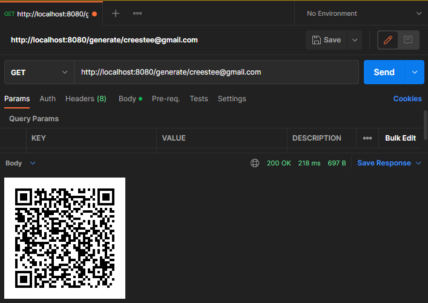
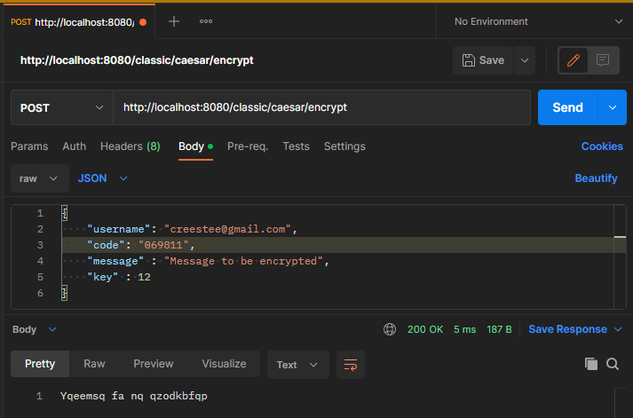
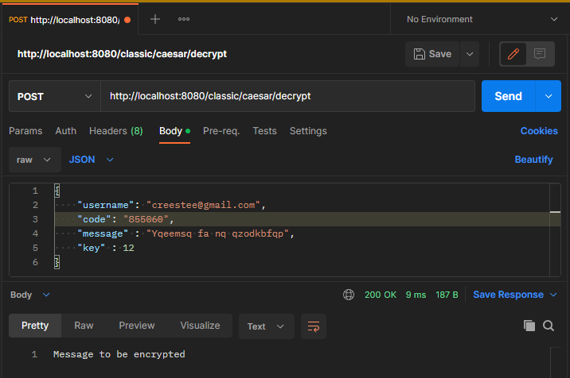

# Topic: Web Authentication & Authorisation

## Course: Cryptography & Security

### FAF - 202

### Author: Cristian Ionel


----

## Overview

&ensp;&ensp;&ensp; Authentication & authorization are 2 of the main security goals of IT systems and should not be used interchangibly. Simply put, during authentication the system verifies the identity of a user or service, and during authorization the system checks the access rights, optionally based on a given user role.

&ensp;&ensp;&ensp; There are multiple types of authentication based on the implementation mechanism or the data provided by the user. Some usual ones would be the following:
- Based on credentials (Username/Password);
- Multi-Factor Authentication (2FA, MFA);
- Based on digital certificates;
- Based on biometrics;
- Based on tokens.

&ensp;&ensp;&ensp; Regarding authorization, the most popular mechanisms are the following:
- Role Based Access Control (RBAC): Base on the role of a user;
- Attribute Based Access Control (ABAC): Based on a characteristic/attribute of a user.


## Objectives:
1. Take what you have at the moment from previous laboratory works and put it in a web service / serveral web services.
2. Your services should have implemented basic authentication and MFA (the authentication factors of your choice).
3. Your web app needs to simulate user authorization and the way you authorise user is also a choice that needs to be done by you.
4. As services that your application could provide, you could use the classical ciphers. Basically the user would like to get access and use the classical ciphers, but they need to authenticate and be authorized.

## Implementation description

For this laboratory work I've used library `GoogleAuth`, which is a Java library that implements the Time-based One-time Password (TOTP) algorithm specified in RFC 6238. 

The following bean creates and set repository for user credentials :

```java
@Bean
public GoogleAuthenticator gAuth() {
    GoogleAuthenticator googleAuthenticator = new GoogleAuthenticator();
    googleAuthenticator.setCredentialRepository(credentialRepository);
    return googleAuthenticator;
}
```

`CredentialRepository` class stores credential data that will be used during authorization. For demo, I added a simple username in the form of an email into a hashmap, which represents the userKeys :

```java
private final Map<String, UserTOTP> usersKeys = new HashMap<String, UserTOTP>() {{
    put("creestee@gmail.com", null);
}};
```

When a user wishes to log in, he will provide the TOTP password generated by his device. By default, a TOTP password is a 6 digit integer that changes every 30 seconds. Both the password length and its validity can be changed. The following code checks the validity of the specified `password` against the provided Base32-encoded `secretKey`:

```java
GoogleAuthenticator gAuth = new GoogleAuthenticator();
boolean isCodeValid = gAuth.authorize(secretKey, password);
```

So, the flow is basically like this : user generates a QR Code for his username on the `generate/{username}` endpoint :

```java
    @GetMapping("/generate/{username}")
    public void generate(@PathVariable String username, HttpServletResponse response) {
        final GoogleAuthenticatorKey key = gAuth.createCredentials(username);

        QRCodeWriter qrCodeWriter = new QRCodeWriter();

        String otpAuthURL = GoogleAuthenticatorQRGenerator.getOtpAuthTotpURL("CS-LAB-DEMO", username, key);

        BitMatrix bitMatrix = qrCodeWriter.encode(otpAuthURL, BarcodeFormat.QR_CODE, 200, 200);

        ServletOutputStream outputStream = response.getOutputStream();
        MatrixToImageWriter.writeToStream(bitMatrix, "PNG", outputStream);
        outputStream.close();
    }
```

configures Google Authenticator for generating TOTP passwords and in the end user can use `/classic/caesar/encrypt` endpoint for the Caesar Cipher service :

```java
    @PostMapping("/classic/caesar/encrypt")
    public String caesarEncrypt(@RequestBody EncryptionDto body) {
        if (gAuth.authorizeUser(body.getUsername(), body.getCode())) {
            return new CaesarCipher(body.getKey()).encrypt(body.getMessage());
        }
        else return "Not valid 2FA Code";
    }
```

Everything was tested in Postman :






## Conclusions

Implementation of 2-Factor Authentication in my project was relatively easy thanks to the library I've found (GoogleAuth). I found out that Google 2FA relies on TOTP codes, so in fact I read about TOTP security. 

Unlike passwords, TOTP codes are single-use, so a compromised credential is only valid for a limited time. However, users must enter TOTP codes into an authentication page, which creates the potential for phishing attacks. Due to the short window in which TOTP codes are valid, attackers must proxy the credentials in real time. 

TOTP credentials are also based on a shared secret known to both the client and the server, creating multiple locations from which a secret can be stolen. An attacker with access to this shared secret could generate new, valid TOTP codes at will. This can be a particular problem if the attacker breaches a large authentication database.